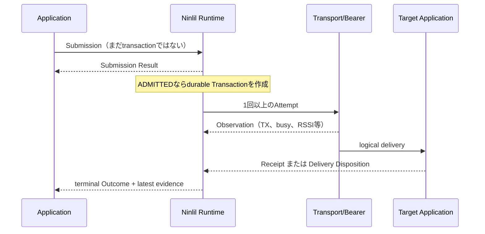

# 02. Ninlil Application Contracts

状態: Normative contract baseline (Fable review reflected)

## 目的

Application developer が radio packet、parent、channel、retry を直接操作せず、「何を、誰へ、いつまでに、どこまで確認したいか」を宣言できる共通 model を定めます。

本章は logical contract です。LoRa frame の byte layout ではありません。

## 1つの要求の一生



`Observation`は運び方の事実、`Receipt`はtarget側のpositive evidence、`Outcome`はlogical transactionの判定です。どれか1つを他の代わりに使いません。

## 公開 model の7要素

| 概念 | 意味 |
| --- | --- |
| `Runtime` | 有限資源を所有し、要求を実行・追跡する Ninlil instance |
| `ServiceDescriptor` | application service が登録する静的な通信契約 |
| `Submission` | admission前にcallerが提出する要求。transaction IDはまだ持たない |
| `ApplicationData` | admission後にNinlilが所有する1件の論理data / intent |
| `Transaction` | admission 後から終端まで追跡する論理取引 |
| `Receipt` | 宛先側が特定段階に到達した証拠 |
| `Outcome` | deadline と後続証拠を含む最終判定 |

Transport の queue、TX、RX、RSSI は `Observation` として別に扱います。

## 6つのApplication Contract family

### 1. EventFact

既に発生した、失ってはいけない事実です。

例:

- 冷凍庫の扉が開いた。
- 水位が危険域へ入った。
- machine fault が発生した。

規則:

- immutable event identity を持つ。
- 後続 event で置換しない。
- 同一 event の retry は新しい事実を作らない。
- service contract が要求する durability まで保持する。
- active / clear のような別 transition は別 event とする。
- 「確認できるまで保持する」serviceは`NINLIL_NO_DEADLINE`を使用できる。その場合、required evidence到達または明示的な監査付きdiscardまでactive origin spoolに残す。
- finite attempt budgetはbusy loopを防ぐ1 retry cycleの上限であり、事実を捨てる上限ではない。Bearer state revisionのうちfresh `available=1`で通信可能性の改善を示す`availability_epoch`、またはoperator操作で再開する。Degradation epochでは再開しない。Runtime resourceの`capacity_epoch`とは別domainであり、詳細は12・13章を正本とする。

### 2. DesiredStateCommand

対象 application に望む絶対状態を適用する要求です。

例:

- valve を closed にする。
- e-ink panel を maintenance 表示にする。
- warning light を on にする。

規則:

- idempotency key と generation を持つ。
- `received` と `applied` を分ける。
- physical feedback が必要な service は `verified` を要求する。
- cancel は未実行部分を止めるだけで、既に起きた effect を元に戻さない。
- supersede は service policy が明示した replace scope だけで許可する。

### 3. LatestState

現在の状態だけに意味があり、未送信の古い状態を捨てられる data です。

例:

- 駐車区画の occupancy bitmap
- device health snapshot
- 現在の battery state

規則:

- replace key と単調 generation を持つ。
- 古い generation を application へ再適用しない。
- state transition の履歴が業務上必要なら、別途 EventFact を発行する。
- periodic reconciliation の有無を contract に記載する。

### 4. MeasurementBatch

時刻または sequence を持つ有限個の計測値です。

例:

- 温度60 sample
- 5分間の流量集計
- vibration の短い統計量

規則:

- sample sequence / time base を宣言する。
- loss、downsample、aggregation、retention の許容範囲を contract に記載する。
- alert に変換された異常 transition は EventFact として扱う。
- 無限 stream は扱わない。

### 5. BoundedTransfer

有限長のまとまった object を原子的に渡す転送です。

例:

- e-ink image
- 表示辞書
- 小さな設定 asset

規則:

- total length、content digest、deadline、上限を事前に知る。
- chunk / fragment は bearer 内部表現とする。
- 全体検証前に application へ部分適用しない。
- pause、resume、abort の状態を有限に保持する。
- large object は Wi-Fi / USB profile を優先する。

### 6. ConfigRevision

検証してから切り替える、versioned configuration です。

例:

- calibration
- reporting policy
- application template set

規則:

- `stage -> validate -> commit` を分ける。
- revision と content digest を持つ。
- last-known-good と rollback rule を定義する。
- incomplete revision を active にしない。

ConfigRevisionは公開familyとして維持します。内部実装がBoundedTransferとDesiredStateCommandを合成しても構いませんが、stage/validate/commit/rollbackを各applicationへ再実装させません。

## Internal Control family

### NetworkControl

Ninlil 自身の control plane message です。

例:

- Attachment grant
- Route lease
- Traffic grant
- Schedule revision

一般 application は登録・発行できません。専用 resource pool と authorization を使います。したがってApplication developer向けには「7番目のfamily」と数えません。

Public `service_register`からNetworkControlを登録しようとした場合は拒否します。正確なstatusは[12-foundation-abi.md](12-foundation-abi.md)を正本とします。

## ServiceDescriptor

Application service は Runtime 起動時または signed manifest 適用時に、静的 descriptor を登録します。

| Field | 内容 |
| --- | --- |
| namespace / service | globally managed な service identity |
| schema identity / versions | payload schema と対応範囲 |
| contract family | 6つのpublic familyのどれか |
| direction | uplink / downlink / bidirectional |
| logical payload limit | logical data の最大 byte 数 |
| typical rate / maximum rate | 平常と hard ceiling |
| burst envelope | 件数、byte、時間窓 |
| inflight limit | 同時 transaction 上限 |
| deadline range | 許可する最短・最長 |
| target limit | 1 transaction の最大 concrete target 数 |
| supported evidence | received / durable / applied / verified |
| persistence | source、controller、endpointで必要な durability |
| replace / batch | coalesce、replace、aggregation rule |
| transfer | fragment / resume 可否と上限 |
| bearers | 利用可能経路と preference |
| power compatibility | mains / sleepy / service mode |
| route policy | hop、diversity、fallback の許容範囲 |
| resource class | queue / journal / dedup profile |

Application が request ごとに自由な `urgent` flag を付けることは禁止します。Site policy が namespace / service に scheduler class、quota、reserved capacity を割り当てます。

## SubmissionとApplicationData

Callerはtransaction IDを持たないSubmissionを提出します。Admission Authorityがatomic admission時にtransaction IDを割り当て、ApplicationDataとTransactionを作ります。

Submissionは概念として次を持ちます。

- source application instance
- namespace / service / schema / schema version
- destination selector
- family別deadline policy / evidence grace
- required evidence
- idempotency key
- generation / replace key（該当 family）
- content digest
- family-specific metadata
- bounded payload

`ApplicationData`はadmission後にRuntimeが所有する概念recordの名称です。M1aでは独立したpublic C typeとして公開せず、Transaction、payload、descriptor snapshotとして保存します。

Contract familyはServiceDescriptorから一意に決まり、Submission側で重複指定しません。

同じ field をすべての radio frame へ繰り返し載せる必要はありません。Attachment 内の short handle、schema alias、fragment manifest などへ圧縮できます。

## Identity の分離

| Identity | 役割 |
| --- | --- |
| transaction ID | logical operation。経路・retryを跨いで不変 |
| attempt ID | 1回の path / bearer / retry attempt |
| frame identity | replay protection と physical frame observation |
| idempotency key | caller の重複提出を同じ transaction へ収束 |
| event ID | EventFact の事実identity |
| generation | state / command の新旧順序 |

Receipt を frame の `boot + sequence` だけへ結び付けません。1 transaction が複数 attempt、fragment、parent を持てるためです。

## Destination resolution

Application は次の selector を利用できます。

- stable device identity
- logical installation / endpoint identity
- named group
- capability query（policyで許可された場合）

Generic resolverはSite Controllerの責務です。KGuard等のproductはlogical installationやgroupのmapping dataを提供しますが、解決結果を固定し、binding epochを検査する機構はNinlil側に置きます。M1aはselectorを受理せず、concrete target 1件だけを受理します。

Admission 時に selector を concrete target roster へ固定します。

- 後から group membership が変わっても既存 transaction の target は変えない。
- target ごとの child outcome を持つ。
- broadcast frame を使用しても、logical success は target 別 evidence で判定する。
- concrete target が0件で required evidence がある要求は admission しない。
- logical installationを使う場合は`installation identity + bound device identity + binding epoch`を固定する。

## Admission の意味

`ADMITTED` は次を意味します。

> Admission AuthorityがSubmissionとtarget rosterを検証・永続化し、local journal、queue、retry、dedup等の列挙された有限資源を予約し、最終Outcomeを返す責任を引き受けた。

配送成功、RF空き、LBT成功、遠隔nodeの生存を保証するものではありません。

### Admission assurance

Admission Resultは、少なくとも次のassessmentについて`required / passed / not_applicable`を返します。

- local durable custody
- concrete target binding
- remote capability snapshot
- path feasibility
- receive-window feasibility
- airtime budget feasibility
- compliance feasibility

Service、environment、release profileが`required`にしたassessmentは、`passed`でなければadmitできません。Virtual M1aではpath/window/airtime/complianceを`not_applicable`にできますが、実radio profileで未評価のままadmitしてはいけません。

Admission Authorityが予約するのは自分が所有するlocal resourceだけです。Remote endpointのdedup/result-cache枠は、fresh capability snapshotで検査するか、delivery時Dispositionとして処理します。remote reservation protocolがないreleaseで予約済みと主張しません。

### Admission 手順

1. 長さ、schema、version を検証する。
2. source / target identity と membership を確認する。
3. service authorization と effective capability を確認する。
4. family 固有 rule を確認する。
5. required evidence を target が生成できるか確認する。
6. release/profileでrequiredなsleep schedule、route、deadline、bearer、airtime、compliance feasibilityを確認する。
7. authorityが所有するqueue、journal、dedup、fragment、attempt budgetを予約する。
8. concrete roster と transaction を atomic に永続化する。
9. admission result を返す。

### Admission result

| Result | Ownership |
| --- | --- |
| `ADMITTED_READY` | Ninlil が所有し、schedulerへ投入可能。即時TXの意味ではない |
| `ADMITTED_SCHEDULED` | Ninlil が所有し、既知の将来 window で実行 |
| `ALREADY_ADMITTED` | 同じ idempotency key の既存 transaction を返す |
| `COUNTER_OFFERED` | 条件変更案。まだ Ninlil は所有しない |
| `REJECTED` | Ninlil は所有しない。理由と再試行可能性を返す |
| `IDEMPOTENCY_CONFLICT` | 同じscope/keyでsubmission digestが異なる。新規要求を所有しない |

曖昧な `deferred` は public result に使いません。「後でNinlilが送る」のか「callerが再提出する」のか分からなくなるためです。

Receipt level、deadline、target を Ninlil が勝手に弱めません。弱める必要がある場合は `COUNTER_OFFERED` とし、caller が明示的に同意します。

Bearer の offload は admission outcome ではなく、admitted transaction の path decision です。

M1aは`ADMITTED_READY`、`ALREADY_ADMITTED`、`REJECTED`、`IDEMPOTENCY_CONFLICT`だけを生成します。`ADMITTED_SCHEDULED`と`COUNTER_OFFERED`は将来互換の予約値で、M1aでは生成せず、offer acceptance APIもunsupportedです。

## Observation、Receipt、Outcome

### Observation

Transport の事実です。

- queued
- carrier busy
- radio TX completed
- ACK frame received
- RSSI / SNR
- parent changed
- retry count

Observation は application success の証拠ではありません。

### Receipt

宛先側 issuer が logical transaction に対して発行するpositive evidenceです。Stageは累積的で後退しません。

| Stage | 意味 |
| --- | --- |
| `RECEIVED` | 認証、再構成、Service Adapterによるpayload validationが完了 |
| `DURABLY_RECORDED` | 必要な電断耐性を持つ保存が完了 |
| `APPLIED` | endpoint application が effect 完了を返した |
| `VERIFIED` | physical feedback / semantic check まで完了 |

Site Controller 自身が application data を保存する uplink event では、controller が `DURABLY_RECORDED` issuer になれます。

Receipt は最低限、次へ binding します。

- transaction ID
- concrete target
- issuer identity
- stage
- schema / content digest または generation
- evidence data

Coreはenvelope、identity、digest、schema identityだけを検査します。Payloadの業務validationは登録済みService Adapterの責務です。

失敗はReceipt stageに混ぜず、Delivery Dispositionとして返します。M1a集合は`RETRY_LATER`、`INVALID_PAYLOAD`、`UNSUPPORTED_SCHEMA`、`UNAUTHORIZED_SERVICE`、`STALE_NOT_APPLIED`、`APPLICATION_BUSY`、`APPLY_FAILED`、`VERIFY_FAILED`、`CAPACITY_EXHAUSTED`、`OUTCOME_UNKNOWN`です。Dispositionは到達していないReceiptを成立させません。Effect certainty、retry guidance、reasonの許容組合せは12章を唯一の正本とします。

### Outcome

Transaction の最終判定です。

`REJECTED`と`COUNTER_OFFERED`はSubmission Resultであり、Transaction Outcomeではありません。

```text
ACTIVE:
  READY | WAITING_WINDOW | DISPATCHING | AWAITING_EVIDENCE | PARKED_RETRY

TERMINAL:
  SATISFIED
  EXPIRED
  CANCELLED_BEFORE_EFFECT
  SUPERSEDED_BEFORE_DISPATCH
  FAILED_DEFINITIVE
  OUTCOME_UNKNOWN
```

規則:

- terminal outcome は不変。
- late receipt は evidence log へ追記するが、期限内成功へ書き換えない。
- 期限後に applied が判明した場合、「期限時点の Outcome」と「後日観測した applied」を両方保持する。
- cancel 後に既に effect が起きていた可能性があれば `OUTCOME_UNKNOWN` または late evidence で表す。
- caller が required evidence を指定し、そこへ到達して初めて `SATISFIED` になる。
- Foundationのgroup transactionは全targetがrequired evidenceへ到達した場合だけ`SATISFIED`になる。
- snapshotは`deadline_verdict`と`latest_evidence_stage`を別々に返す。

## Family ごとの backpressure

| Family | Queue pressure 時の基本動作 |
| --- | --- |
| EventFact | 上書き禁止。reserved spoolを使用し、満杯なら明示 failure / local fail-safe |
| DesiredStateCommand | 許可された同一 replace scope の未dispatchだけ supersede可能 |
| LatestState | 古い generation を coalesce |
| MeasurementBatch | policy内で aggregate / downsample / retention expiry |
| BoundedTransfer | pause / bearer変更 / abort |
| ConfigRevision | incomplete revisionをcommitせずlast-known-good維持 |
| NetworkControl | 専用pool。一般dataに追い出されない |

## Generic examples

### Reliable command

```text
service: greenhouse.valve.state
family: DesiredStateCommand
target: valve installation A
payload: CLOSED
deadline: 5s
required evidence: VERIFIED
```

### Durable event

```text
service: cold-storage.door.alarm
family: EventFact
event: OPEN_TOO_LONG
required evidence: DURABLY_RECORDED
```

### Replaceable state

```text
service: parking.occupancy.snapshot
family: LatestState
replace key: zone-3
generation: 1082
payload: occupancy bitmap
```

これらの example は KGuard を知らなくても動かせる conformance fixture にします。

## Public API 原則

- C ABI を基準とする。
- `submit` 後の payload ownership を明記する。
- callback pointer の lifetime と re-entry rule を明記する。
- polling / event queue model を提供し、特定 RTOS callback model に固定しない。
- raw radio send、channel、TX power、arbitrary urgent flag を application API に公開しない。
- query は Observation、Receipt、Outcome を別 field で返す。
- error は reason code、`RETRY_SAME_AFTER / RETRY_MODIFIED / OPERATOR_ACTION / NEVER`のguidance、counter-offerの有無を返す。

概念 API:

```c
ninlil_runtime_create(config, platform_ops, &runtime);
ninlil_service_register(runtime, descriptor, callbacks, &service);
ninlil_submit(service, submission, &result);
ninlil_offer_accept(runtime, offer_id, &result);
ninlil_cancel_request(runtime, transaction_id, &result);
ninlil_transaction_query(runtime, transaction_id, &snapshot);
ninlil_transaction_list(runtime, query, &page);
ninlil_delivery_complete(runtime, delivery_token, application_result);
ninlil_capacity_snapshot(runtime, &capacity);
ninlil_runtime_step(runtime, budget);
```

Foundationで実装する正確なownership、threading、型と引数は[12-foundation-abi.md](12-foundation-abi.md)を正本とします。

## Fable reviewで維持した判断

- 6つのpublic familyと内部NetworkControlを分離する。
- ConfigRevisionを公開familyとして維持する。
- `ADMITTED_READY`を維持し、即時送信の意味ではないと明記する。
- counter-offerの思想は維持し、生成/acceptance実装はM2へ送る。
- Outcomeとlate evidenceを分け、unknownをfalse failure/successへ潰さない。
