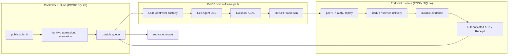

# V1-LAB 項目 10b 前半（統合 E2E gate）受入証拠

- 作業dir: `/Users/dt/job/LoRa/ninlil-d3s3-implementation`
- build dir: `tmp-v1`（`NINLIL_ENABLE_SANITIZERS=ON` = ASan/UBSan）
- 計画: `docs/work/2026-07-23-ninlil-v1-lab-plan.md` 項目 10b 統合 gate 節
- 日付: 2026-07-24
- 範囲: 統合 E2E gate のみ（packaging/docs/RC tag は 10b 後半）

## 実装概要

| 層 | 内容 |
|---|---|
| 統合 topology | `tests/support/v1_lab_integration_topology.{h,c}` — 単一プロセス controller+endpoint、共有 bearer、C4/C5 inject |
| E2E gate | `tests/runtime/v1_integration_gate_e2e_test.c` — 11 シナリオ + structural check を単一実行 |
| CTest 登録 | `cmake/ninlil_v1_integration_gate_ctest.cmake` |
| structural gate | `tools/v1_integration_gate.py` + `v1_lab_integration_structural_check()` |

## Topology（単一実行）



経路: `public submit → family/admission/reservation → durable queue → USB Controller/Cell Agent software path → W1/L1 AEAD → R9 host SPI/radio simulation → peer RX auth/replay → dedup/service delivery → durable evidence → authenticated ACK/Receipt → source outcome`

結線: 項目2 Runtime + 項目4 admission + 項目6 family + 項目8 secure + 項目9 USB/radio（fake provider なし）。test-only bearer inject が C4/C5 フルパスへ橋渡し。

## 注入 × 結果

| ID | シナリオ | 注入 | 期待 | false success | bounded termination | fail-closed |
|---|---|---|---|---|---|---|
| 1 | HAPPY | なし | outcome 成立 | 0 | yes | n/a |
| 2 | ACK_LOSS | ACK drop 1 回 | outcome 成立（再送） | 0 | yes | n/a |
| 3 | DATA_DUPLICATE | radio 重複 deliver 1 回 | outcome 成立（dedup） | 0 | yes | n/a |
| 4 | REORDER_REPLAY | 保存 frame の replay inject | outcome 成立、replay/auth reject | 0（delivery≤1） | yes | n/a |
| 5 | TIMEOUT | data drop + clock 進行 | outcome 不成立 | 0 | yes | yes |
| 6 | RETRY_EXHAUSTED | APPLICATION send 全 drop | outcome 不成立 | 0 | yes | yes |
| 7 | CTRL_RESTART | step=6 controller restart | outcome 成立 | 0 | yes | n/a |
| 8 | END_RESTART | step=6 endpoint restart | outcome 成立 | 0 | yes | n/a |
| 9 | CRC_FAULT | wire CRC 破損 | outcome 不成立 | 0 | yes | yes |
| 10 | AUTH_FAULT | wire auth 破損 | outcome 不成立 | 0 | yes | yes |
| 11 | STORAGE_FAULT | controller DB 破損 | outcome 不成立 | 0 | yes | yes |

単一実行での検証:

```
$ cd tmp-v1 && ./ninlil_v1_integration_gate_e2e_test
structural_check bypass_call_sites=0
v1_integration_gate_e2e_test ok
```

## Structural check（bypass 成功経路不在）

bypass symbol: `ninlil_c6_lab_spi_tx_bypass_direct`

```
$ python3 tools/v1_integration_gate.py check
v1_integration_gate structural check ok
bypass_symbol=ninlil_c6_lab_spi_tx_bypass_direct
production_call_sites_outside_allowlist=0
```

E2E 内 `v1_lab_integration_structural_check()`:

- integration gate ソースへの bypass **call site** = 0
- allowlist 外 production ソースへの bypass 参照 = 0（定義は `c6_lab_spi_tx_sim.{c,h}` のみ）
- `bypass_attempt_count=0`, `production_bypass_on_success=0`

## CTest

```
$ cd tmp-v1 && ctest -N -R v1_integration_gate
Test project /Users/dt/job/LoRa/ninlil-d3s3-implementation/tmp-v1
  Test #167: v1_integration_gate_e2e
  Test #168: v1_integration_gate_structural

Total Tests: 2
```

```
$ ctest -R v1_integration_gate --output-on-failure
Test #167: v1_integration_gate_e2e ..........   Passed
Test #168: v1_integration_gate_structural ...   Passed

100% tests passed, 0 tests failed out of 2
```

```
$ ctest -N | tail -1
Total Tests: 250
```

## stub / TODO

`tests/support/v1_lab_integration_topology.*`, `tests/runtime/v1_integration_gate_e2e_test.c`, `tools/v1_integration_gate.py`, `cmake/ninlil_v1_integration_gate_ctest.cmake`: **0**（`TODO`/`STUB`/`FIXME` なし）。

## 非主張

- host simulation 上の統合 gate。実 RF/HIL・packaging・RC tag は 10b 後半。
- public ABI 変更なし。既存 test 弱化なし。bypass 経路の成功利用なし。

RC=0
